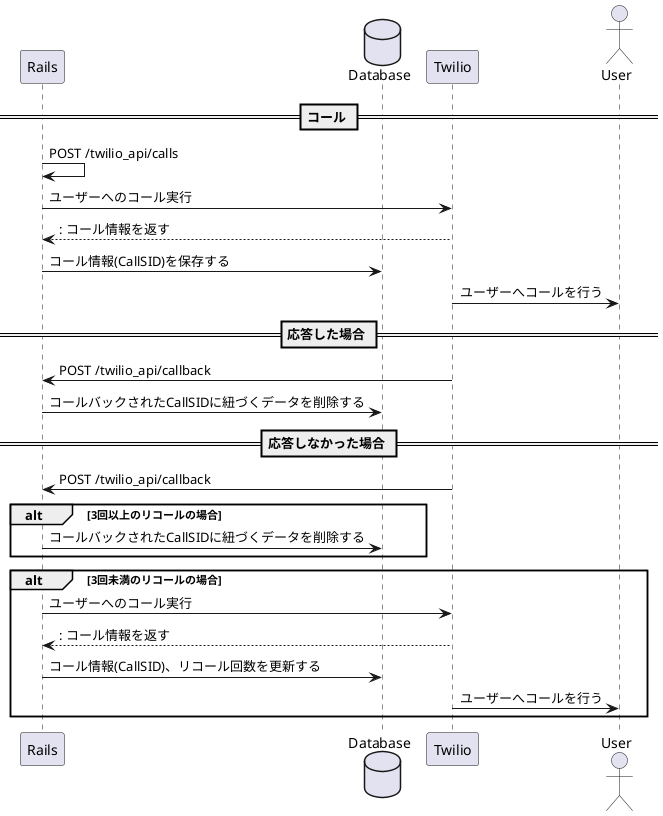

<!--
https://www.plantuml.com/plantuml/uml/jPDF3z8m6CRl_HJlKG-6WpUI6HAvUD88daqPEonE85k9Lxh6FuA9n8XAGC4e7Y0WHcA8ckp3l7JWj_3j9ambAfh8eIrht-VvFUkxGY2uBvetFTQWsRNT1gy9kCfTBm0UW6yMhCe5h_300VeLzslQhLP-g2hVSZstRZP4icBS5dKVhWMERnusQMRCiW33zwW-evg1PJ6MMC2v2wbN7gvSBfKXbofSvmqtPtFF2x9ZwKuUKBqnAk47CyeroiL1Loz6kvSFcE-8fb_BPtwnkgt7xp1yj8iUe-ndtfJawDYPY-HRkbGyI-StqNCzVqOb67OOImbCcObqJBBNeKB2G7adIQsZuNPEjazHZlHufRltA7uczlly5MxV-0KjgYugXU5Rb3qCoMxq3HpbRBlgefoWV8ZgRe8O4PE-t_xIVvs6-PbiYhA3yjK_8pBk2JYl1oysdoQRTTjSYfeUKEblAii0_aSOfrRD2EBXDFxOEeNWz8u2-7DF0PpMLItvFPW1xYr99XwiuYVB_Uq0_7MpfM-XG2DzrLy1
-->

