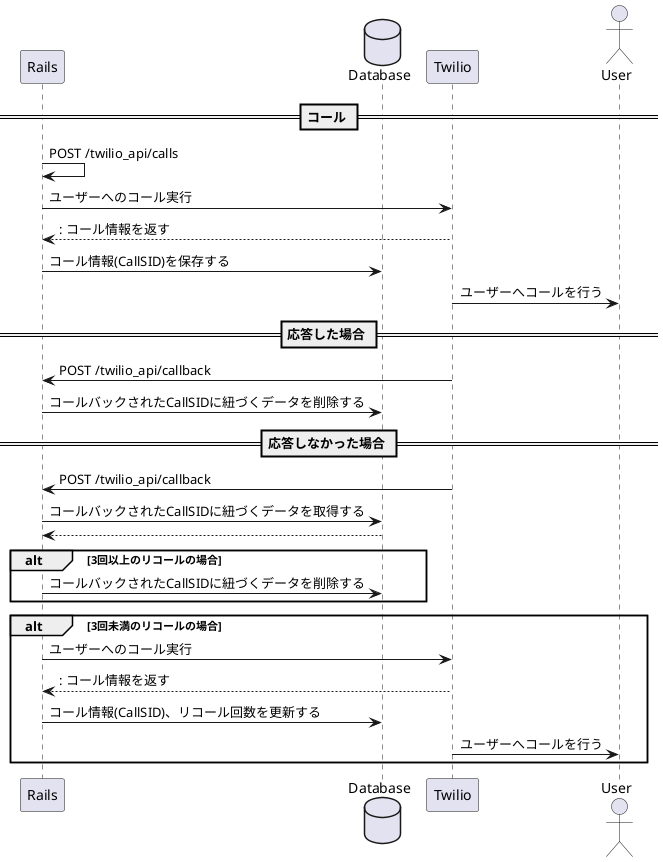

<!--
https://www.plantuml.com/plantuml/uml/nPBFhX8n5CRtVOgpr8Mv2tSaOsxYtRZIUAzhKuPPJ1p-PAOJjtGQ_mWc42CW0GMZk82068aXQfo7ENJ0jx2TegCIKHRcpg9jfZtVz_lQSnmmwhEmw96AcbtRhT0IWvlKzGAW0VXwGGgKqJmD753VoNQjTmlvNwhExhgUMzORB5qHQhEo3xS2nzS_GpKJObc0qNiKdr5CmB88IItWqXNZbOCRrq_FuCWetAOLzyYcdXTanynE3b2yqIhH1pto9VBP3rqv6snUFYQ-mqA_bCly4d5F3jzXz6GJFqNUpRnLafrZ5wugtzDh9nVL-LNyN4wVgHACweGO0bsc8-sIVDTHXGe3-VqqjOpxwwcoxI0VoE52DX_g-9dOtlnvQj_v0osA9Wg1qLlaBOoKtM0BZdooNZIHZv0tK3n84MF591_LldPVcp2_ausHrv6_EdV4Hbj-wMmHpJCIGZq6bsNlnUhJQBMiwVSMuyo2pmmn0VWVz-IK2Xb1qXyd7wlx2GvjLe2_jol0lpLibVyCfe5RSoMJz1P9Usu2QR63-zZSmh4QmwBt3G00
-->

